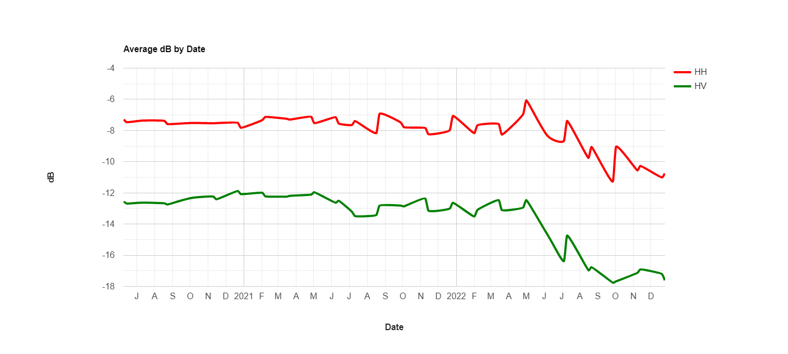
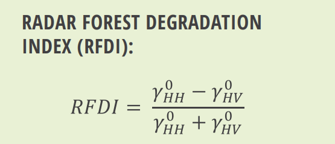
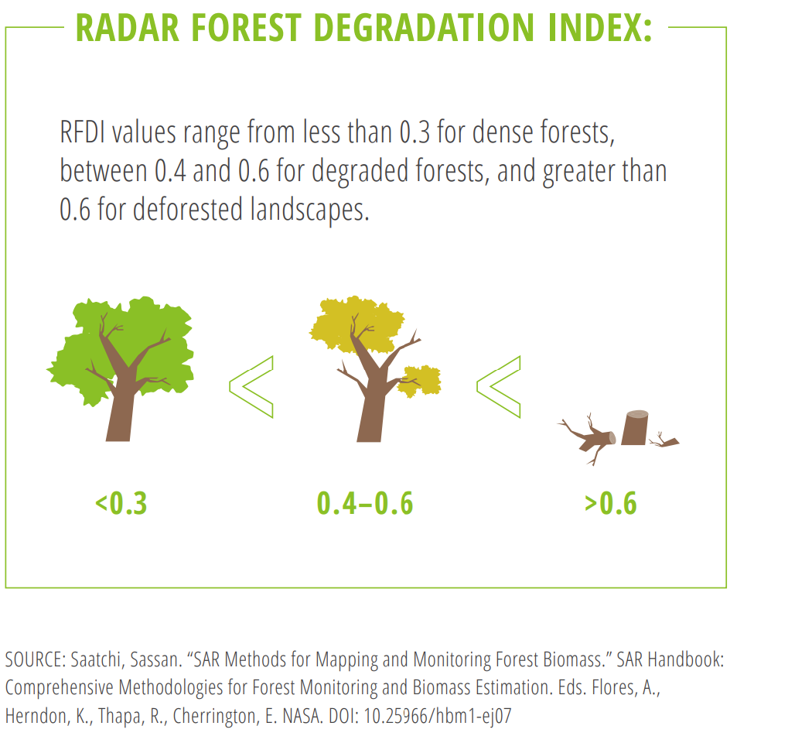
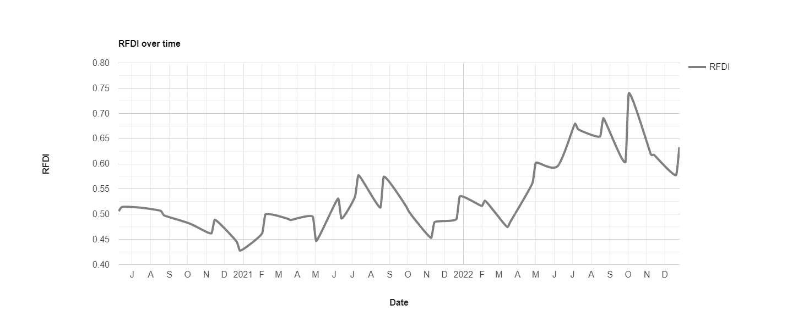
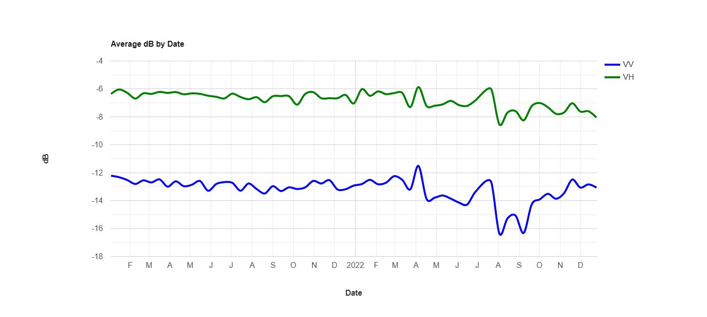
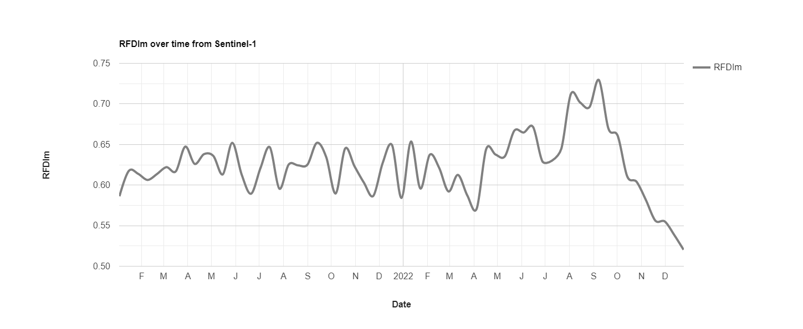

## Exercise 2: Plotting Sentinel-1 and Alos Palsar Time series data over a deforestation event

We will keep working in the same deforestation spot, Lat: -4.011&deg; , Lon: 141.303&deg;. 

We will create a small polygon around the point of interest.
```java
var defPaG = ee.Geometry.Point([141.303, -4.011])

//create buffer around point of interest - circle of about 10Ha
var aoi = defPaG.buffer(178.4146)

Map.addLayer(aoi, {}, 'aoi')
// Zoom to area of of interest
Map.centerObject(aoi, 13);
```
Define dates of interest
```java
var firstdate = '2021-01-01'
var seconddate = '2022-12-31'
 ```

Then, we will call and filter by date, location and available polarizations Image Collections of  [Alos Palsar ScanSAR](https://developers.google.com/earth-engine/datasets/catalog/JAXA_ALOS_PALSAR-2_Level2_2_ScanSAR) and [Sentinel-1 GRD](https://developers.google.com/earth-engine/datasets/catalog/COPERNICUS_S1_GRD) data. 
```java
//Alos Palsar data
var collectionALOS =  ee.ImageCollection('JAXA/ALOS/PALSAR-2/Level2_2/ScanSAR')
  .filterBounds(defPaG)
  .filterDate(firstdate, seconddate)
  .filter(ee.Filter.eq('Polarizations', ["HH", "HV"]))
  
//Create collections by polarizations
var collectionHH = collectionALOS.select('HH'); 
var collectionHV = collectionALOS.select('HV');

//Sentinel-1 data

var sentinel1 = ee.ImageCollection('COPERNICUS/S1_GRD');

//Get descending mode
var ddata = sentinel1
  // Filter to get images with VV and VH dual polarization.
  .filter(ee.Filter.listContains('transmitterReceiverPolarisation', 'VV'))
  .filter(ee.Filter.listContains('transmitterReceiverPolarisation', 'VH'))
  // Filter to get images collected in interferometric wide swath mode.
  .filter(ee.Filter.eq('instrumentMode', 'IW'))
  .filter(ee.Filter.eq('orbitProperties_pass', 'DESCENDING'))
  .filterDate(firstdate, seconddate)
  .filterBounds(defPaG);

print(ddata, 'Sentinel-1 Descending')

//Create collections by polarizations
var collectionVV = ddata.select('VV')
var collectionVH = ddata.select('VH')

//Visualize one of the images for Alos Palsar
Map.addLayer(collectionHH.first(), {min: 0, max: 8000}, 'First image HH polarization');

```
Transform Alos Palsar data to dB 
```java
//Create function to tranform Alos Palsar bands HH and HV to dB
function todBall (image) {
  var dBHH =  (ee.Image((image.select('HH').pow(2)).log10()).multiply(10).subtract(83)).rename('dBHH')
  var dBHV =  (ee.Image((image.select('HV').pow(2)).log10()).multiply(10).subtract(83)).rename('dBHV')
  return image.addBands([dBHH, dBHV]).copyProperties(image, ["system:time_start"]);
}

//Apply to relevant IC
var AlosdB = collectionALOS.map(todBall)

```
Plot data in one graph
```java
//Integrated graph
// Define the chart and print it to the console.
var chart = ui.Chart.image.series({
  imageCollection: AlosdB.select('dBHH', 'dBHV'),
  region: aoi,
  reducer: ee.Reducer.mean(),
  scale: 30,
  xProperty: 'system:time_start'
})
.setSeriesNames(['HH', 'HV'])
.setOptions({
  title: 'Average dB by Date',
  hAxis: {title: 'Date', titleTextStyle: {italic: false, bold: true}},
  vAxis: {
    title: 'dB ',
    titleTextStyle: {italic: false, bold: true}
  },
  lineWidth: 4,
  colors: ['red', 'green'],
  curveType: 'function'
});
print(chart);
```


<sub>Figure 1. Chart of HH and HV polarization over time for aoi </sub>

Now, we will calculate the [Radar Forest Degradation Index](https://servirglobal.net/Portals/0/Documents/Articles/2019_SAR_Handbook/SAR_VegIndices_1page_new.pdf) as described in the [SAR Handbook](https://servirglobal.net/Global/Articles/Article/2674/sar-handbook-comprehensive-methodologies-for-forest-monitoring-and-biomass-estimation). 






<sub>Figure 2. RFDI calculation and interpretation. Source: [SAR Vegetation Indices](https://servirglobal.net/Portals/0/Documents/Articles/2019_SAR_Handbook/SAR_VegIndices_1page_new.pdf) . </sub>

```java
//Create function to transform data from dB to power
function dbToPowerALL(img){
  var powerHH = ee.Image(10).pow(img.select('dBHH').divide(10)).rename('powerHH')
  var powerHV = ee.Image(10).pow(img.select('dBHV').divide(10)).rename('powerHV')
  return img.addBands([powerHH, powerHV]);
}
//Apply to the dB Image Collection
var AlosPw = AlosdB.map(dbToPowerALL)

//Create function to calculate RFDI 
function RFDIall (image){
  var rfdi = image.normalizedDifference(['powerHH', 'powerHV']).rename('RFDI')
  return image.addBands(rfdi)
}

//Apply RFDI function to data. This will add a band 'RFDI' in each image in the Image Collection
var withRFDIall =AlosPw.map(RFDIall)

//Chart RFDI 
var chartRFDIall = ui.Chart.image.series({
  imageCollection: withRFDIall.select('RFDI'),
  region:  aoi,
  reducer: ee.Reducer.mean(),
  scale: 30
}).setOptions({
  title: 'RFDI over time',
  hAxis: {title: 'Date', titleTextStyle: {italic: false, bold: true}},
  vAxis: {
    title: 'RFDI ',
    titleTextStyle: {italic: false, bold: true}
  },
  lineWidth: 4,
  colors: ['gray'],
  curveType: 'function'
});

print(chartRFDIall)

```


<sub>Figure 3. Expected RFDI graph </sub>

___
> ####  Question 1: 
> *Based on the graphs of the individuals polarizations and the RFDI, can you identify the date on which Alos Palsar sees a change  on the surface?  *
___

Now, we will plot the Sentinel-1 data 
```java
//First, process the GRD data to get Gamma naught in dB by applying pre-defined functions
//Get relevant functions
var functions = require('users/africa_uah/SAREdX:00.Functions')
var powerToDb = functions.powerToDb
var dbToPower = functions.dbToPower
var terrainCorrection = functions.terrainCorrection
var gammaMap = functions.gammaMap

//Correct Sentinel-1 GRD data 
var ICofRGBs0 = ddata.map(terrainCorrection)
var ICofRGBs1 = ICofRGBs0.map(gammaMap)//get VV and VH in dB 

// Define the chart and print it to the console.
var chartS1 = ui.Chart.image.series({
  imageCollection: ICofRGBs1.select('VV', 'VH'),
  region: aoi,
  reducer: ee.Reducer.mean(),
  scale: 30,
  xProperty: 'system:time_start'
})
.setSeriesNames(['VV', 'VH'])
.setOptions({
  title: 'Average dB by Date',
  hAxis: {title: 'Date', titleTextStyle: {italic: false, bold: true}},
  vAxis: {
    title: 'dB ',
    titleTextStyle: {italic: false, bold: true}
  },
  lineWidth: 4,
  colors: ['blue', 'green'],
  curveType: 'function'
});
print(chartS1);
```

<sub>Figure 4. Expected graph for VV and VH </sub>

___
> ####  Question 2: 
> *Navigate through the graph portraying Sentinel-1 time series of VV and VH polarizations. Which date do you see there was a change? *
___


Now lets calculate a modified version of the RFDI with Sentinel-1 data. Instead of the HH polarization we will use VV, which is the one available for Sentinel-1.

```java
//Transform bands from dB to power
var SentICpow =  function (image){
    var VV = dbToPower(image.select('VV')).rename('VVpw')
    var VH = dbToPower(image.select('VH')).rename('VHpw')
    return image.addBands([VV, VH])
}

var SentIC = ICofRGBs1.map(SentICpow)

print(SentIC, 'SentIC')

//Create function to calculate RFDIm. This will add a RFDIm band to each image in the collection
function RFDIm (image){
  var rfdim = image.normalizedDifference(['VVpw', 'VHpw']).rename('RFDIm')
  return image.addBands(rfdim)
}

var RFDImSen = SentIC.map(RFDIm)

//Graph RFDI 
var chartRFDISen = ui.Chart.image.series({
  imageCollection: RFDImSen.select('RFDIm'),
  region:  aoi,
  reducer: ee.Reducer.mean(),
  scale: 30
}).setOptions({
  title: 'RFDIm over time from Sentinel-1',
  hAxis: {title: 'Date', titleTextStyle: {italic: false, bold: true}},
  vAxis: {
    title: 'RFDIm ',
    titleTextStyle: {italic: false, bold: true}
  },
  lineWidth: 4,
  colors: ['gray'],
  curveType: 'function'
});

print(chartRFDISen)
```

<sub>Figure 5. Expected graph for RFDI calculated from Sentinel-1 </sub>


Full [script](https://code.earthengine.google.com/738b37bf6a494ad6c56bf230d0702b2c)
___
> ####  Final discussion: 
> *Can you identify more clearly the date of change using the RFDI? Which date do you see there was a change? 

> *How does the time series from Alos Palsar and Sentinel-1 differ? Are changes detected at different times? *

Tip: Check the theory associated with these exercises to inform your discussion.
___
